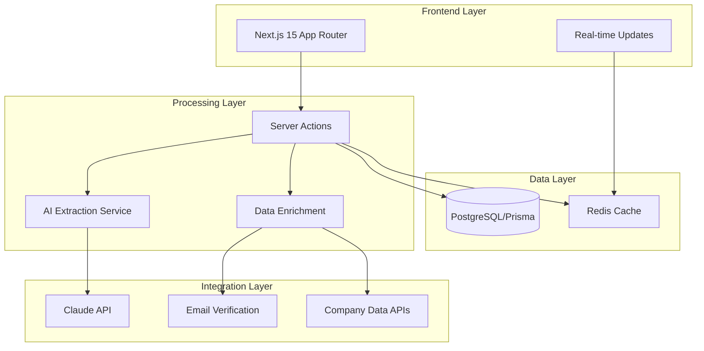

# Technical Product Development Requirements (PDR)
## Lead Generation Automation System

**Version:** 1.0
**Date:** September 2024
**Status:** Draft
**Author:** Tech Team

---

## 1. Executive Summary

This Technical PDR defines the architecture, implementation details, and technical specifications for an AI-powered Lead Generation Automation System. The system enables team members to quickly input potential lead data by copy/pasting raw information, with automatic extraction of key fields and full CRUD capabilities for lead management.

## 2. System Architecture

### 2.1 High-Level Architecture



### 2.2 Technology Stack

| Layer | Technology | Purpose |
|-------|------------|---------|
| **Frontend** | Next.js 15.5.3, React 19, Tailwind CSS v4 | UI/UX, Real-time updates |
| **Backend** | Node.js, Server Actions | Business logic, API endpoints |
| **Database** | PostgreSQL, Prisma 6.16.2 | Data persistence |
| **Cache** | Redis (optional) | Real-time updates, session data |
| **AI** | Claude 3 API, Vercel AI SDK | Data extraction, enrichment |
| **Auth** | NextAuth v5 | Authentication & authorization |
| **Deployment** | Vercel | Hosting, edge functions |

## 3. Database Schema

### 3.1 Lead Model

```prisma
model Lead {
  id                String    @id @default(cuid())

  // Core fields
  name              String
  company           String?
  email             String?   @unique
  phone             String?
  website           String?   @url
  description       String?   @db.Text
  notes             String?   @db.Text

  // Extraction metadata
  rawInput          String    @db.Text
  extractionMetadata Json?    // {confidence, model, extractedAt}
  confidence        Float?    @default(0)

  // Enrichment data
  enrichmentData    Json?     // {companySize, industry, revenue}
  linkedinUrl       String?
  companySize       String?
  industry          String?

  // Status & tracking
  status            LeadStatus @default(NEW)
  score             Int?      @default(0)
  tags              String[]
  source            LeadSource @default(MANUAL)
  priority          Priority  @default(MEDIUM)

  // Relationships
  userId            String
  user              User      @relation(fields: [userId], references: [id])
  assignedTo        String?
  assignedUser      User?     @relation("AssignedLeads", fields: [assignedTo], references: [id])
  interactions      Interaction[]
  history           LeadHistory[]

  // Timestamps
  createdAt         DateTime  @default(now())
  updatedAt         DateTime  @updatedAt
  lastContactedAt   DateTime?
  nextFollowUp      DateTime?

  // Indexes for performance
  @@index([userId, status])
  @@index([email])
  @@index([company])
  @@index([assignedTo])
  @@index([createdAt(sort: Desc)])
  @@fulltext([name, description, notes])
}

model LeadHistory {
  id        String   @id @default(cuid())
  leadId    String
  lead      Lead     @relation(fields: [leadId], references: [id], onDelete: Cascade)
  action    String   // CREATE, UPDATE, DELETE, STATUS_CHANGE
  changes   Json     // {field: {old, new}}
  userId    String
  user      User     @relation(fields: [userId], references: [id])
  createdAt DateTime @default(now())

  @@index([leadId])
  @@index([userId])
}

model Interaction {
  id        String   @id @default(cuid())
  leadId    String
  lead      Lead     @relation(fields: [leadId], references: [id], onDelete: Cascade)
  type      InteractionType
  subject   String?
  content   String   @db.Text
  userId    String
  user      User     @relation(fields: [userId], references: [id])
  createdAt DateTime @default(now())

  @@index([leadId])
}

enum LeadStatus {
  NEW
  CONTACTED
  QUALIFIED
  PROPOSAL
  NEGOTIATION
  CLOSED_WON
  CLOSED_LOST
  ARCHIVED
}

enum LeadSource {
  MANUAL
  IMPORT
  API
  WEBSITE
  REFERRAL
  SOCIAL_MEDIA
  EMAIL_CAMPAIGN
}

enum Priority {
  LOW
  MEDIUM
  HIGH
  URGENT
}

enum InteractionType {
  EMAIL
  CALL
  MEETING
  NOTE
  STATUS_CHANGE
}
```

## 4. API Endpoints Specification

### 4.1 Server Actions (Primary API)

```typescript
// src/components/leads/clients/actions.ts

// Lead CRUD Operations
async function createLead(input: CreateLeadInput): Promise<Lead>
async function updateLead(id: string, input: UpdateLeadInput): Promise<Lead>
async function deleteLead(id: string): Promise<void>
async function getLead(id: string): Promise<Lead>
async function listLeads(params: ListLeadsParams): Promise<PaginatedLeads>

// AI-Powered Operations
async function extractAndCreateLead(rawText: string): Promise<Lead>
async function bulkImportLeads(entries: string[]): AsyncGenerator<ImportProgress>
async function enrichLead(id: string): Promise<Lead>

// Search & Filter
async function searchLeads(query: string, filters?: LeadFilters): Promise<Lead[]>
async function getLeadStats(): Promise<LeadStatistics>

// Interactions
async function addInteraction(leadId: string, interaction: InteractionInput): Promise<Interaction>
async function getInteractions(leadId: string): Promise<Interaction[]>
```

### 4.2 REST API Endpoints (Alternative)

| Method | Endpoint | Description |
|--------|----------|-------------|
| **POST** | `/api/leads/extract` | Extract lead from raw text |
| **POST** | `/api/leads/bulk-import` | Bulk import leads |
| **GET** | `/api/leads` | List leads with pagination |
| **POST** | `/api/leads` | Create new lead |
| **GET** | `/api/leads/:id` | Get lead details |
| **PUT** | `/api/leads/:id` | Update lead |
| **DELETE** | `/api/leads/:id` | Delete lead |
| **POST** | `/api/leads/:id/enrich` | Enrich lead data |
| **GET** | `/api/leads/search` | Search leads |
| **GET** | `/api/leads/stats` | Get statistics |
| **GET** | `/api/leads/stream` | SSE for real-time updates |

### 4.3 Request/Response Schemas

```typescript
// Input Schemas (Zod)
const createLeadSchema = z.object({
  name: z.string().min(1).max(100),
  company: z.string().optional(),
  email: z.string().email().optional(),
  phone: z.string().optional(),
  website: z.string().url().optional(),
  description: z.string().optional(),
  notes: z.string().optional(),
  tags: z.array(z.string()).optional(),
  status: z.enum(["NEW", "CONTACTED", ...]).optional(),
  source: z.enum(["MANUAL", "IMPORT", ...]).optional()
});

const bulkImportSchema = z.object({
  entries: z.array(z.string()),
  autoEnrich: z.boolean().default(false),
  skipDuplicates: z.boolean().default(true)
});

// Response Types
interface LeadResponse {
  data?: Lead;
  error?: string;
  metadata?: {
    confidence: number;
    extractedFields: string[];
    duplicateCheck: boolean;
  };
}

interface BulkImportResponse {
  total: number;
  succeeded: number;
  failed: number;
  duplicates: number;
  results: ImportResult[];
}
```

## 5. AI Agent Configuration

### 5.1 Claude Integration Structure

```typescript
// src/lib/ai/claude-config.ts

export const claudeConfig = {
  extraction: {
    model: "claude-3-opus-20240229",
    temperature: 0.3,
    maxTokens: 2000,
    systemPrompt: `You are a lead extraction specialist. Extract the following information from raw text:
    - Name (person's full name)
    - Company (organization name)
    - Email (email address)
    - Phone (phone number)
    - Website (company website)
    - Description (role, purpose, or context)
    - Notes (any additional relevant information)

    Return the data in JSON format with confidence scores for each field.
    If a field cannot be determined, set it to null.`,

    examples: [
      {
        input: "John Doe from Acme Corp (john@acme.com, 555-1234) interested in enterprise plan",
        output: {
          name: "John Doe",
          company: "Acme Corp",
          email: "john@acme.com",
          phone: "555-1234",
          notes: "interested in enterprise plan",
          confidence: 0.95
        }
      }
    ]
  },

  enrichment: {
    model: "claude-3-sonnet-20240229",
    temperature: 0.5,
    maxTokens: 1000,
    systemPrompt: `Research and enrich lead information with:
    - Company size
    - Industry
    - Key decision makers
    - Recent news or updates
    - Potential pain points`
  },

  classification: {
    model: "claude-3-haiku-20240307",
    temperature: 0.2,
    maxTokens: 500,
    systemPrompt: `Classify and score leads based on:
    - Qualification criteria
    - Buying signals
    - Priority level
    - Recommended next actions`
  }
};
```

### 5.2 Extraction Pipeline

```typescript
// src/lib/ai/extraction-pipeline.ts

export class ExtractionPipeline {
  async process(rawText: string): Promise<ExtractedLead> {
    // Step 1: Pre-process text
    const cleaned = this.preprocessText(rawText);

    // Step 2: Pattern detection
    const patterns = this.detectPatterns(cleaned);

    // Step 3: AI extraction
    const extracted = await this.aiExtract(cleaned, patterns);

    // Step 4: Validation
    const validated = this.validateFields(extracted);

    // Step 5: Confidence scoring
    const scored = this.calculateConfidence(validated);

    // Step 6: Duplicate detection
    const duplicates = await this.checkDuplicates(scored);

    return {
      ...scored,
      duplicates,
      metadata: {
        processedAt: new Date(),
        pipeline: "v1.0",
        stages: ["preprocess", "detect", "extract", "validate", "score"]
      }
    };
  }

  private detectPatterns(text: string): DetectedPatterns {
    return {
      emails: text.match(/[\w._%+-]+@[\w.-]+\.[A-Z|a-z]{2,}/gi) || [],
      phones: text.match(/[\+]?[(]?[0-9]{1,3}[)]?[-\s\.]?[(]?[0-9]{1,4}[)]?[-\s\.]?[0-9]{1,4}[-\s\.]?[0-9]{1,9}/g) || [],
      urls: text.match(/https?:\/\/(www\.)?[-a-zA-Z0-9@:%._\+~#=]{1,256}\.[a-zA-Z0-9()]{1,6}\b([-a-zA-Z0-9()@:%_\+.~#?&//=]*)/gi) || [],
      linkedin: text.match(/linkedin\.com\/in\/[\w-]+/gi) || [],
      companies: this.detectCompanyNames(text)
    };
  }
}
```

## 6. File Structure

```
D:/repo/codebase-underway/
├── prisma/
│   └── models/
│       └── lead.prisma                # Lead data models
│
├── src/
│   ├── app/
│   │   └── [lang]/
│   │       └── (expose)/
│   │           └── (protected)/
│   │               └── leads/
│   │                   ├── page.tsx       # Main leads page
│   │                   ├── import/
│   │                   │   └── page.tsx   # Import interface
│   │                   └── [id]/
│   │                       └── page.tsx   # Lead detail view
│   │
│   ├── components/
│   │   └── leads/
│   │       └── clients/               # Refactored from students
│   │           ├── _components/
│   │           │   ├── create-lead-sheet.tsx
│   │           │   ├── update-lead-sheet.tsx
│   │           │   ├── delete-leads-dialog.tsx
│   │           │   ├── lead-form.tsx
│   │           │   ├── import-form.tsx
│   │           │   ├── lead-preview.tsx
│   │           │   └── bulk-operations.tsx
│   │           ├── _lib/
│   │           │   ├── actions.ts     # Server actions
│   │           │   ├── queries.ts     # Data queries
│   │           │   ├── validations.ts # Zod schemas
│   │           │   ├── extraction.ts  # AI extraction
│   │           │   └── enrichment.ts  # Data enrichment
│   │           ├── table.tsx          # Leads table
│   │           ├── columns.tsx        # Table columns
│   │           ├── content.tsx        # Page content
│   │           ├── types.ts           # TypeScript types
│   │           ├── constants.ts       # Enums and constants
│   │           ├── hooks.ts           # React hooks
│   │           └── README.md          # Documentation
│   │
│   └── lib/
│       └── ai/
│           ├── claude-config.ts       # AI configuration
│           ├── extraction-pipeline.ts # Processing pipeline
│           └── patterns.ts            # Pattern detection
```

## 7. Implementation Phases

### Phase 1: Foundation (Week 1-2)
- [ ] Set up database schema
- [ ] Create basic CRUD server actions
- [ ] Implement leads table with existing components
- [ ] Basic form for manual lead creation

### Phase 2: AI Integration (Week 3-4)
- [ ] Integrate Claude API for extraction
- [ ] Implement paste interface
- [ ] Add field detection and preview
- [ ] Create extraction pipeline

### Phase 3: Bulk Operations (Week 5)
- [ ] Bulk import functionality
- [ ] Progress tracking
- [ ] Duplicate detection
- [ ] Error handling and recovery

### Phase 4: Enrichment (Week 6)
- [ ] Data enrichment integration
- [ ] Company data APIs
- [ ] Email verification
- [ ] Lead scoring

### Phase 5: Real-time & Polish (Week 7-8)
- [ ] Real-time updates (SSE)
- [ ] Mobile responsive design
- [ ] Performance optimization
- [ ] Testing and documentation

## 8. Performance Requirements

| Metric | Target | Notes |
|--------|--------|-------|
| **Page Load** | < 1s | Initial page load with SSR |
| **Extraction Time** | < 3s per lead | AI processing time |
| **Bulk Import** | 100 leads/minute | With parallel processing |
| **Search Response** | < 200ms | Full-text search |
| **Real-time Updates** | < 100ms | SSE latency |
| **Database Queries** | < 50ms | Indexed queries |

## 9. Security Considerations

### 9.1 Data Protection
- Encrypt sensitive data at rest
- Use HTTPS for all communications
- Implement rate limiting on AI calls
- Sanitize all user input

### 9.2 Access Control
- Role-based access (RBAC)
- Row-level security for leads
- Audit trail for all operations
- Session management with NextAuth

### 9.3 AI Security
- API key rotation
- Request validation
- Output sanitization
- Cost monitoring and limits

## 10. Testing Strategy

### 10.1 Unit Tests
```typescript
// Example test structure
describe('Lead Extraction', () => {
  it('should extract email from text', async () => {
    const result = await extractLead('Contact john@example.com');
    expect(result.email).toBe('john@example.com');
  });

  it('should handle multiple formats', async () => {
    // Test various input formats
  });
});
```

### 10.2 Integration Tests
- API endpoint testing
- Database operations
- AI service mocking
- End-to-end workflows

### 10.3 Performance Tests
- Load testing with k6
- Database query optimization
- Caching effectiveness
- Real-time update stress tests

## 11. Monitoring & Analytics

### 11.1 Key Metrics
- Lead conversion rate
- Extraction accuracy
- Processing time
- System errors
- API usage and costs

### 11.2 Logging
```typescript
// Structured logging
logger.info('Lead created', {
  leadId: lead.id,
  userId: user.id,
  source: 'IMPORT',
  confidence: 0.95,
  timestamp: new Date()
});
```

## 12. Future Enhancements

### Phase 2 Features
- CRM integrations (Salesforce, HubSpot)
- Email campaign automation
- Advanced lead scoring with ML
- Team collaboration features
- Mobile application

### Technical Improvements
- GraphQL API
- Webhook system
- Advanced caching with Redis
- Microservices architecture
- Multi-tenancy support

## 13. Dependencies & Risks

### Dependencies
- Claude API availability
- Third-party enrichment APIs
- Database performance
- Vercel hosting limits

### Risks & Mitigations
| Risk | Impact | Mitigation |
|------|--------|------------|
| AI extraction errors | High | Manual review queue |
| API rate limits | Medium | Caching and queuing |
| Data loss | High | Regular backups |
| Cost overruns | Medium | Usage monitoring |

## 14. Success Criteria

- 90% extraction accuracy for standard formats
- < 3 second processing time per lead
- 99.9% uptime for core features
- 50% reduction in manual data entry time
- Positive user feedback score > 4.5/5

## 15. Appendices

### A. Sample Data Formats
```text
// Format 1: Structured
Name: John Doe
Company: Acme Corp
Email: john@acme.com
Phone: 555-1234

// Format 2: Narrative
Met John Doe from Acme Corp at the conference.
He's interested in our enterprise solution.
Contact: john@acme.com or 555-1234

// Format 3: Mixed
John Doe <john@acme.com>
Acme Corp | VP of Sales
(555) 123-4567
Looking for Q1 implementation
```

### B. Error Codes
| Code | Description | Resolution |
|------|-------------|------------|
| E001 | Extraction failed | Check input format |
| E002 | Duplicate lead | Review existing lead |
| E003 | Invalid email | Verify email format |
| E004 | API limit reached | Wait or upgrade plan |

---

**Document Version History:**
- v1.0 - Initial Technical PDR (September 2024)