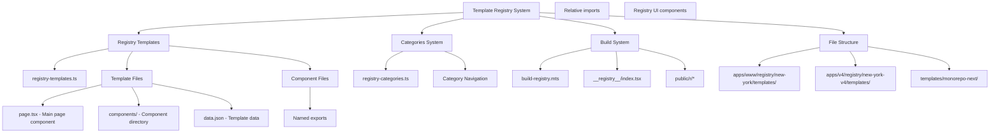
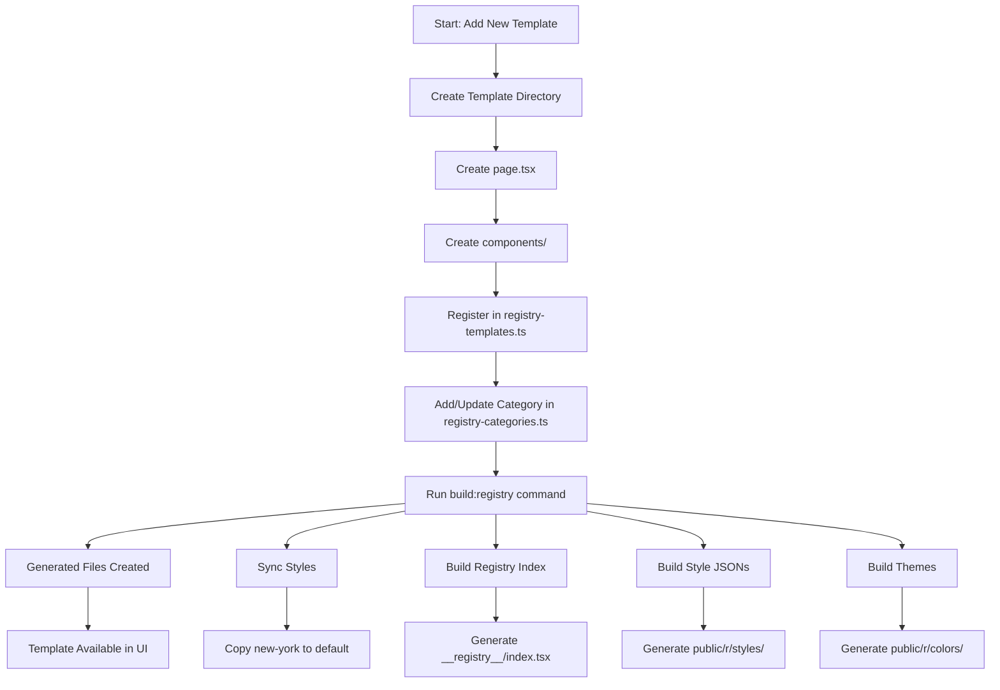

# Templates System Documentation

## Overview

This document provides comprehensive documentation for the template system used in this shadcn/ui registry project. It traces all related files, packages, dependencies, and includes architectural flow charts for copying this system to another project.

## What Are Templates and Auto-Generation

### Template System Concept

The template system is a **component registry and code generation framework** that allows developers to:

1. **Browse pre-built UI components and layouts** in a visual gallery
2. **Copy/install complete component trees** with a single command
3. **Auto-generate boilerplate code** for common UI patterns
4. **Maintain consistency** across projects with standardized components

### Auto-Generation Scope

The system automatically generates several types of files and configurations:

#### 1. **Registry Index Generation** (`__registry__/index.tsx`)
```typescript
// Auto-generated file that creates lazy-loaded component mappings
export const Index: Record<string, any> = {
  "new-york": {
    "dashboard-01": {
      name: "dashboard-01",
      component: React.lazy(() => import("@/registry/new-york/templates/dashboard-01/page")),
      files: [...], // Auto-populated file paths
      dependencies: [...], // Auto-extracted dependencies
    }
  }
}
```

**Scope**:
- Creates importable component registry
- Enables lazy loading for performance
- Maps template names to actual components
- Extracts and lists all template files automatically

#### 2. **JSON Configuration Files** (`public/r/styles/[style]/[template].json`)
```json
{
  "$schema": "https://ui.shadcn.com/schema/registry-item.json",
  "name": "dashboard-01",
  "type": "registry:template",
  "files": [
    {
      "path": "templates/dashboard-01/page.tsx",
      "content": "// Auto-extracted source code",
      "target": "app/dashboard/page.tsx"
    }
  ],
  "dependencies": ["@tanstack/react-table"],
  "registryDependencies": ["button", "card"]
}
```

**Scope**:
- Packages complete template source code
- Defines installation targets
- Lists all dependencies automatically
- Creates CLI-consumable format

#### 3. **Theme and Color Generation** (`public/r/colors/[color].json`)
```json
{
  "slate": {
    "cssVars": {
      "light": { "background": "0 0% 100%", "foreground": "222.2 84% 4.9%" },
      "dark": { "background": "222.2 84% 4.9%", "foreground": "210 40% 98%" }
    },
    "cssVarsTemplate": "/* Auto-generated CSS with variables */"
  }
}
```

**Scope**:
- Generates theme configurations
- Creates CSS variable mappings
- Supports light/dark mode automatically
- Provides ready-to-use CSS templates

#### 4. **Style Synchronization** (Default ↔ New York)
The system automatically:
- Copies templates between style variants
- Updates import paths (`@/registry/new-york/` → `@/registry/default/`)
- Maintains consistency across style systems
- Syncs changes when templates are updated

### Template Categories and Their Scope

#### **Dashboard Templates** (`dashboard-*`)
**Purpose**: Complete dashboard layouts with navigation, content areas, and data visualization

**Auto-Generated Components**:
- Sidebar navigation with collapsible sections
- Main content area with breadcrumbs
- Data tables with sorting/filtering
- Chart components with interactive features
- Header with user controls

**Scope**:
- Full-page layouts
- Complex state management
- Multiple UI component integration
- Data visualization patterns

#### **Sidebar Templates** (`sidebar-*`)
**Purpose**: Navigation sidebar variations for different use cases

**Auto-Generated Components**:
- Collapsible/expandable sidebars
- Multi-level navigation menus
- User profile sections
- Search functionality
- Theme switchers

**Scope**:
- Navigation patterns
- Responsive behavior
- State persistence
- Accessibility features

#### **Login Templates** (`login-*`)
**Purpose**: Authentication form layouts and patterns

**Auto-Generated Components**:
- Form validation logic
- Input field styling
- Layout variations (single column, split screen, etc.)
- Social login buttons
- Error handling displays

**Scope**:
- Form management
- Validation patterns
- UI layout variations
- Authentication flows

#### **Hero Templates** (`hero-*`)
**Purpose**: Landing page hero sections

**Auto-Generated Components**:
- Call-to-action buttons
- Typography layouts
- Background patterns
- Animation triggers
- Responsive breakpoints

**Scope**:
- Marketing page layouts
- Visual hierarchy
- Conversion optimization
- Performance considerations

### Build System Auto-Generation Process

#### **Phase 1: Discovery and Parsing**
```typescript
// Automatically scans registry-templates.ts
for (const item of registry.items) {
  // Discovers all template files
  const resolveFiles = item.files?.map(file => `registry/${style}/${file.path}`)

  // Parses TypeScript/TSX files
  const sourceFile = project.createSourceFile(tempFile, raw, { scriptKind: ScriptKind.TSX })

  // Extracts imports and dependencies
  sourceFile.getImportDeclarations().forEach(node => {
    // Auto-maps to registry dependencies
  })
}
```

#### **Phase 2: Code Transformation**
```typescript
// Automatically fixes import paths
content = content.replace(
  new RegExp(`@/registry/${sourceStyle}/`, "g"),
  `@/registry/${targetStyle}/`
)

// Removes build-specific variables
sourceFile.getVariableDeclaration("iframeHeight")?.remove()
sourceFile.getVariableDeclaration("containerClassName")?.remove()
```

#### **Phase 3: Asset Generation**
```typescript
// Generates lazy-loaded components
component: React.lazy(() => import("@/registry/new-york/templates/dashboard-01/page"))

// Creates JSON manifests for CLI consumption
const payload = registryItemSchema.safeParse({
  $schema: "https://ui.shadcn.com/schema/registry-item.json",
  files: processedFiles,
  dependencies: extractedDeps
})
```

### Integration Points and Scope

#### **CLI Integration**
The auto-generated files enable:
```bash
npx shadcn@latest add dashboard-01
# Automatically downloads, installs, and configures the template
```

**Scope**:
- Package manager integration
- Dependency resolution
- File placement automation
- Configuration updates

#### **Development Server Integration**
```typescript
// Templates appear automatically in development
const template = await import(`@/registry/${style}/templates/${name}/page`)
// Live preview without manual registration
```

**Scope**:
- Hot reloading support
- Preview generation
- Development tooling
- Error boundary handling

#### **Build-Time Optimization**
```typescript
// Tree-shaking unused templates
// Code splitting by template
// Asset optimization
// Bundle size analysis
```

**Scope**:
- Performance optimization
- Bundle analysis
- Dead code elimination
- Chunk splitting strategies

### Template File Structure Auto-Generation

Each template automatically generates:

1. **Main Page Component** (`page.tsx`)
   - Default export for page routing
   - Proper TypeScript types
   - Responsive layout structure

2. **Component Modules** (`components/*.tsx`)
   - Named exports for reusability
   - Props interface definitions
   - Documentation comments

3. **Data Files** (`data.json`) - Optional
   - Mock data for demos
   - Type-safe data structures
   - Realistic sample content

4. **Style Integration**
   - Tailwind CSS classes
   - CSS variable usage
   - Theme compatibility
   - Responsive breakpoints

This comprehensive auto-generation system ensures consistency, reduces manual work, and provides a scalable way to manage and distribute UI components across projects.

## System Architecture



## Template System Flow



## Core Files and Structure

### 1. Template Registry Files

#### Main Registry Configuration
- **Location**: `apps/www/registry/registry-templates.ts`
- **Purpose**: Central configuration for all templates
- **Key Properties**:
  - `name`: Template identifier
  - `description`: Template description
  - `type`: Always "registry:template"
  - `dependencies`: NPM package dependencies
  - `registryDependencies`: UI component dependencies
  - `files`: Array of template files
  - `categories`: Template categorization
  - `meta`: Additional metadata (e.g., iframeHeight)

#### Categories Configuration
- **Location**: `apps/www/registry/registry-categories.ts`
- **Purpose**: Defines available template categories
- **Structure**:
  ```typescript
  {
    name: "Display Name",
    slug: "url-slug",
    hidden: boolean
  }
  ```

### 2. Template File Structure

#### Template Directories
```
apps/www/registry/new-york/templates/[template-name]/
├── page.tsx                       # Main page component
├── components/                    # Component directory
│   ├── component-1.tsx            # Individual components
│   ├── component-2.tsx
│   └── ...
└── data.json                      # Optional data file
```

#### V4 Templates (Alternative Style)
```
apps/v4/registry/new-york-v4/templates/[template-name]/
├── page.tsx
├── components/
└── data.json
```

#### Monorepo Template
```
templates/monorepo-next/
├── apps/web/                      # Web application
├── packages/ui/                   # UI components package
├── packages/eslint-config/        # ESLint configuration
├── packages/typescript-config/    # TypeScript configuration
├── package.json                   # Root package.json
├── pnpm-workspace.yaml           # PNPM workspace config
└── turbo.json                     # Turbo build config
```

### 3. Build System

#### Build Script
- **Location**: `apps/www/scripts/build-registry.mts`
- **Purpose**: Generates registry files and builds the template system
- **Key Functions**:
  - `syncStyles()`: Syncs templates between styles (new-york → default)
  - `buildRegistry()`: Generates `__registry__/index.tsx`
  - `buildStyles()`: Creates individual template JSON files
  - `buildThemes()`: Generates theme CSS and JSON files

#### Generated Files
- **`__registry__/index.tsx`**: Main registry index with lazy-loaded components
- **`public/r/styles/[style]/[template].json`**: Individual template configurations
- **`public/r/colors/[color].json`**: Theme color configurations
- **`public/r/themes.css`**: CSS theme variables

#### Build Commands
```json
{
  "build:registry": "tsx --tsconfig ./tsconfig.scripts.json ./scripts/build-registry.mts && prettier --loglevel silent --write \"registry/**/*.{ts,tsx,mdx}\" --cache",
  "registry:build": "tsx --tsconfig ./tsconfig.scripts.json ./scripts/build-registry.mts && prettier --loglevel silent --write \"registry/**/*.{ts,tsx,mdx}\" --cache"
}
```

## Package Dependencies

### Core Dependencies

#### Build & Development
- **tsx**: TypeScript execution for build scripts
- **ts-morph**: TypeScript compiler API for AST manipulation
- **rimraf**: Cross-platform file deletion
- **prettier**: Code formatting
- **turbo**: Monorepo build system
- **pnpm**: Package manager

#### UI Framework
- **next**: React framework (14.3.0-canary.43)
- **react**: UI library (^18.2.0)
- **tailwindcss**: CSS framework (3.4.6)
- **tailwindcss-animate**: Animation utilities
- **class-variance-authority**: Styling variants
- **clsx**: Conditional className utility
- **tailwind-merge**: Tailwind class merging

#### Radix UI Components
```typescript
{
  "@radix-ui/react-accordion": "^1.1.2",
  "@radix-ui/react-alert-dialog": "^1.0.4",
  "@radix-ui/react-avatar": "^1.0.3",
  "@radix-ui/react-button": "^1.0.3",
  "@radix-ui/react-card": "^1.0.4",
  "@radix-ui/react-checkbox": "^1.0.4",
  "@radix-ui/react-collapsible": "^1.0.3",
  "@radix-ui/react-dialog": "^1.1.1",
  "@radix-ui/react-dropdown-menu": "^2.0.5",
  "@radix-ui/react-input": "^1.0.4",
  "@radix-ui/react-label": "^2.0.2",
  "@radix-ui/react-popover": "^1.0.6",
  "@radix-ui/react-select": "^2.0.0",
  "@radix-ui/react-separator": "^1.0.3",
  "@radix-ui/react-tabs": "^1.0.4"
}
```

#### Template-Specific Dependencies
```typescript
{
  "@dnd-kit/core": "^6.3.1",           // Dashboard drag & drop
  "@dnd-kit/sortable": "^10.0.0",      // Sortable components
  "@tanstack/react-table": "^8.9.1",   // Data tables
  "recharts": "2.12.7",                // Charts
  "sonner": "^1.2.3",                  // Toast notifications
  "react-hook-form": "^7.44.2",        // Form handling
  "zod": "^3.21.4",                    // Schema validation
  "date-fns": "^2.30.0",               // Date utilities
  "lucide-react": "0.477.0"            // Icon library
}
```

### Development Dependencies
```typescript
{
  "@types/node": "^17.0.45",
  "@types/react": "^18.2.65",
  "@types/react-dom": "^18.2.22",
  "eslint": "^8.41.0",
  "typescript": "^5.5.3",
  "contentlayer2": "^0.4.6",           // Content management
  "shiki": "^1.10.1",                  // Syntax highlighting
  "rehype-pretty-code": "^0.6.0"       // Code block styling
}
```

## Template Categories

### Available Categories
1. **Sidebar** (`sidebar`) - Navigation sidebar components
2. **Dashboard** (`dashboard`) - Dashboard layouts (hidden from nav)
3. **Authentication** (`authentication`) - Auth-related templates
4. **Login** (`login`) - Login form templates
5. **Hero** (`hero`) - Hero section templates
6. **Charts** (`charts`) - Chart components (hidden)

### Category Implementation
```typescript
// registry-categories.ts
export const registryCategories = [
  {
    name: "Sidebar",
    slug: "sidebar",
    hidden: false,
  },
  // ... other categories
]
```

## Template Types

### Registry Dependencies
Templates can depend on these registry components:
- **UI Components**: `button`, `card`, `input`, `label`, `dropdown-menu`, etc.
- **Layout Components**: `sidebar`, `breadcrumb`, `separator`
- **Data Components**: `table`, `chart`, `calendar`
- **Form Components**: `checkbox`, `select`, `tabs`
- **Utility Components**: `avatar`, `badge`, `sheet`, `drawer`

### File Types
- **`registry:page`**: Main page component
- **`registry:component`**: Reusable component
- **`registry:file`**: Data or configuration file

## Featured Templates

Templates can be featured on the main page by adding them to:
```typescript
// apps/www/app/(app)/templates/page.tsx
const FEATURED_templates = [
  "dashboard-01",
  "sidebar-01",
  "login-01",
  // ... other featured templates
]
```

## Import Conventions

### Registry Components
```typescript
import { Button } from "@/registry/new-york/ui/button"
import { Card } from "@/registry/new-york/ui/card"
```

### Relative Imports
```typescript
import { YourComponent } from "./your-component"
import { OtherComponent } from "../other-component"
```

### Utilities
```typescript
import { cn } from "@/registry/new-york/lib/utils"
```

## Files to Copy for Implementation

### Essential Files (Required)

Copy these files exactly to implement the templates system:

#### 1. Registry Configuration Files
```
Source → Destination
apps/www/registry/registry-templates.ts → your-project/registry/registry-templates.ts
apps/www/registry/registry-categories.ts → your-project/registry/registry-categories.ts
apps/www/registry/registry-styles.ts → your-project/registry/registry-styles.ts
apps/www/registry/registry-colors.ts → your-project/registry/registry-colors.ts
apps/www/registry/registry-base-colors.ts → your-project/registry/registry-base-colors.ts
apps/www/registry/registry-icons.ts → your-project/registry/registry-icons.ts
apps/www/registry/index.ts → your-project/registry/index.ts
```

#### 2. Build System Files
```
Source → Destination
apps/www/scripts/build-registry.mts → your-project/scripts/build-registry.mts
apps/www/scripts/registry.ts → your-project/scripts/registry.ts
apps/www/tsconfig.scripts.json → your-project/tsconfig.scripts.json
```

#### 3. Base Registry Structure
```
Source → Destination
apps/www/registry/new-york/ → your-project/registry/new-york/
├── ui/ → your-project/registry/new-york/ui/
├── lib/ → your-project/registry/new-york/lib/
├── hooks/ → your-project/registry/new-york/hooks/
└── templates/ → your-project/registry/new-york/templates/
```

#### 4. Generated Files Directory (Create Empty)
```
Create these directories in your project:
your-project/__registry__/
your-project/public/r/
your-project/public/r/styles/
your-project/public/r/colors/
your-project/public/r/themes/
```

### Template Files (Choose What You Need)

#### Copy Specific Templates
```
# Dashboard Template
apps/www/registry/new-york/templates/dashboard-01/ → your-project/registry/new-york/templates/dashboard-01/

# Sidebar Templates
apps/www/registry/new-york/templates/sidebar-01/ → your-project/registry/new-york/templates/sidebar-01/
apps/www/registry/new-york/templates/sidebar-02/ → your-project/registry/new-york/templates/sidebar-02/
# ... (copy other sidebar templates as needed)

# Login Templates
apps/www/registry/new-york/templates/login-01/ → your-project/registry/new-york/templates/login-01/
apps/www/registry/new-york/templates/login-02/ → your-project/registry/new-york/templates/login-02/
# ... (copy other login templates as needed)

# Hero Templates
apps/www/registry/new-york/templates/hero-01/ → your-project/registry/new-york/templates/hero-01/
```

#### UI Components (Copy Required Components)
```
# Essential UI Components (copy these from apps/www/registry/new-york/ui/)
button.tsx
card.tsx
input.tsx
label.tsx
dropdown-menu.tsx
separator.tsx
breadcrumb.tsx
sidebar.tsx
avatar.tsx
badge.tsx
checkbox.tsx
collapsible.tsx
dialog.tsx
popover.tsx
select.tsx
sheet.tsx
switch.tsx
tabs.tsx
table.tsx
calendar.tsx
chart.tsx
```

#### Library Files
```
apps/www/registry/new-york/lib/utils.ts → your-project/registry/new-york/lib/utils.ts
```

### Configuration Files

#### Package.json Scripts
Add these scripts to your `package.json`:
```json
{
  "scripts": {
    "build:registry": "tsx --tsconfig ./tsconfig.scripts.json ./scripts/build-registry.mts && prettier --loglevel silent --write \"registry/**/*.{ts,tsx,mdx}\" --cache",
    "registry:build": "tsx --tsconfig ./tsconfig.scripts.json ./scripts/build-registry.mts && prettier --loglevel silent --write \"registry/**/*.{ts,tsx,mdx}\" --cache"
  }
}
```

#### TypeScript Configuration for Scripts
Create `tsconfig.scripts.json`:
```json
{
  "extends": "./tsconfig.json",
  "compilerOptions": {
    "module": "ESNext",
    "moduleResolution": "bundler",
    "allowSyntheticDefaultImports": true,
    "esModuleInterop": true
  },
  "include": ["scripts/**/*"],
  "exclude": ["node_modules"]
}
```

### Monorepo Template (Optional)
If you want the monorepo template:
```
templates/monorepo-next/ → your-project/templates/monorepo-next/
├── apps/web/ → your-project/templates/monorepo-next/apps/web/
├── packages/ui/ → your-project/templates/monorepo-next/packages/ui/
├── packages/eslint-config/ → your-project/templates/monorepo-next/packages/eslint-config/
├── packages/typescript-config/ → your-project/templates/monorepo-next/packages/typescript-config/
├── package.json → your-project/templates/monorepo-next/package.json
├── pnpm-workspace.yaml → your-project/templates/monorepo-next/pnpm-workspace.yaml
└── turbo.json → your-project/templates/monorepo-next/turbo.json
```

## Migration Guide

### To Copy This System to Another Project:

1. **Copy Core Files**:
   - Follow the file copy list above
   - Maintain exact directory structure

2. **Install Dependencies**:
   ```bash
   pnpm add next react tailwindcss
   pnpm add -D tsx ts-morph rimraf prettier typescript
   ```

3. **Install Registry Dependencies**:
   ```bash
   pnpm add @radix-ui/react-* lucide-react class-variance-authority clsx tailwind-merge
   ```

4. **Setup Build Process**:
   - Add build scripts to `package.json`
   - Configure TypeScript for scripts
   - Setup Prettier configuration

5. **Initialize Registry**:
   - Copy `registry-templates.ts` and `registry-categories.ts`
   - Run `pnpm build:registry`

6. **Template-Specific Dependencies**:
   Install based on templates you want to use:
   ```bash
   pnpm add @tanstack/react-table recharts @dnd-kit/core zod
   ```

## Testing Commands

### Development
```bash
pnpm --filter=www dev                 # Start dev server
```

### Building
```bash
pnpm --filter=www build:registry      # Build registry
pnpm --filter=www build              # Build full project
```

### Access Points
- Templates page: `http://localhost:3000/templates`
- Category page: `http://localhost:3000/templates/sidebar`
- Direct template: `http://localhost:3000/templates#template-name`

## Common Issues & Solutions

### Template Not Appearing
1. Verify template is registered in `registry-templates.ts`
2. Check category exists in `registry-categories.ts`
3. Run `pnpm build:registry`
4. Restart dev server

### Import Errors
1. Use `@/registry/new-york/ui/component-name` for registry components
2. Use relative imports for template components
3. Check component exports are named (not default)

### Build Failures
1. Verify all dependencies are installed
2. Check TypeScript configuration
3. Ensure all template files exist
4. Validate registry schema

---

This documentation provides a complete reference for understanding, using, and migrating the template system. Refer to `add-template.md` for step-by-step instructions on adding new templates.